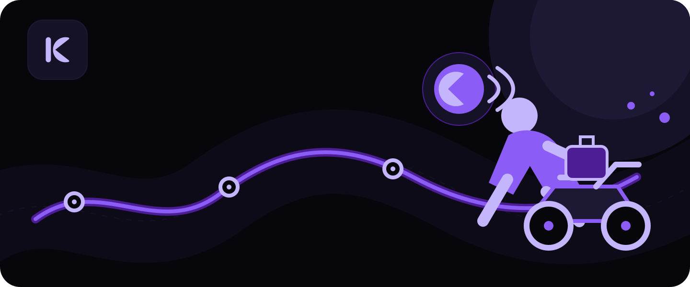
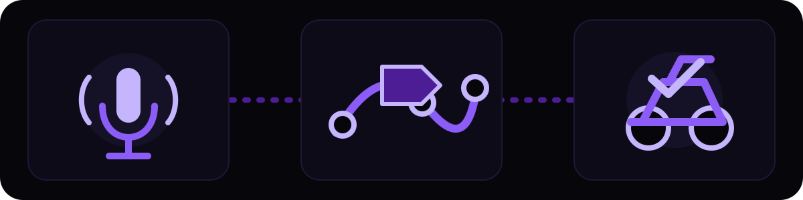
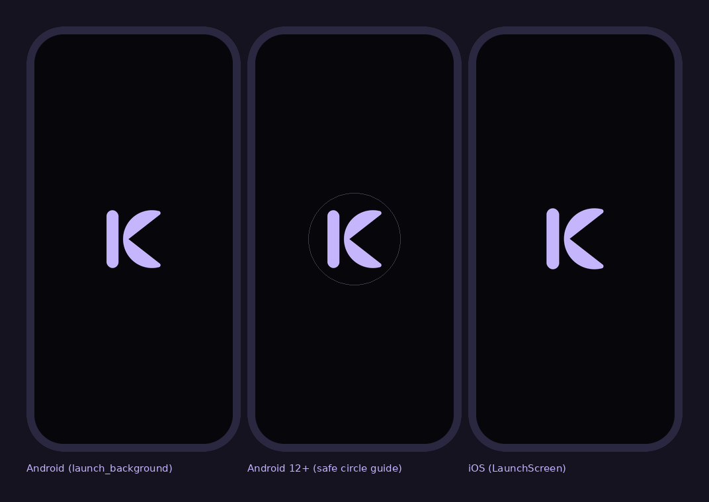
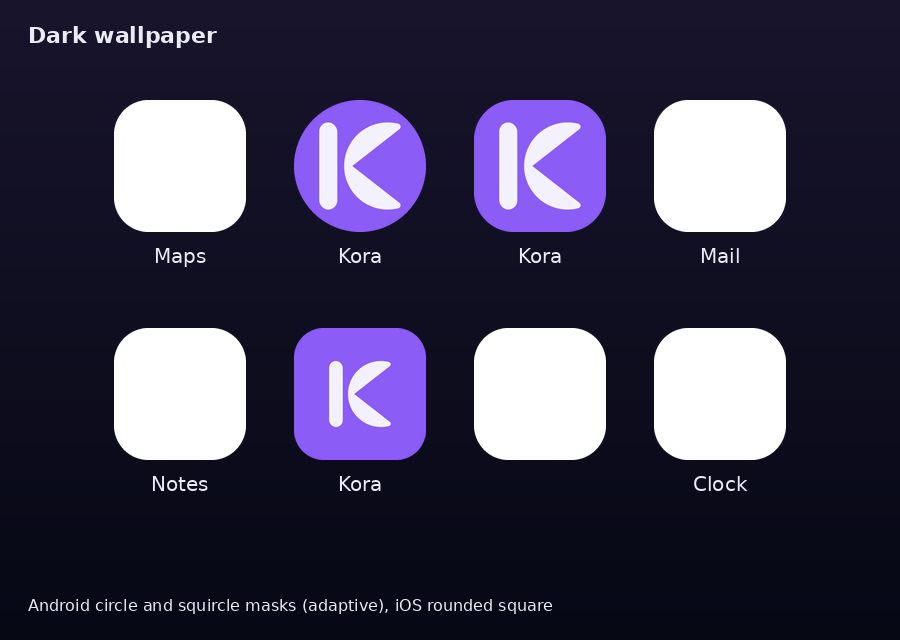

<div align="center">
  
  <h1>Kora</h1>
  <p><strong>Talk to your operations. Let your operations talk back.</strong></p>
  <p>A voice-first co-rider for last-mile delivery drivers.</p>
  <p>
    
    
    
    
  </p>
</div>



Drivers should not have to choose between watching the road and managing work on a screen. Kora lets a driver ask for the next stop, start a route, contact a customer, handle a new order, or finish a shift by speaking naturally.

Built for the [AssemblyAI Voice Agent Hackathon](https://lablab.ai/ai-hackathons/assemblyai-voice-agent-hackathon) on lablab.ai, September 1–30, 2026.

[What Kora is](#what-is-kora) · [A shift with Kora](#a-shift-with-kora) · [What works today](#what-you-can-do-with-kora-today) · [For developers](#for-developers)

## What is Kora?

Kora is a mobile app for people making last-mile deliveries—the final journey from a depot or shop to a customer's door. Instead of repeatedly tapping through a delivery app, the driver talks to a calm co-rider called Kora.

Kora listens, carries out the work across routes, orders and customer communication, then gives one clear spoken answer. The live map and on-screen progress stay available when a glance is useful, but voice remains the main way to work.

## The problem

A delivery shift is full of tiny screen tasks: find the next address, check traffic, call a customer, update a stop, accept another order, and count what is left. Each task is simple at a desk. While travelling by bicycle, scooter, motorbike or car, every tap competes with the road.

Kora closes that gap. The driver says what they need; the app coordinates the steps and speaks back.

## How it works



1. **Speak.** While the app is open, say “Hey Kora” or use the large microphone button. Kora opens with a calm greeting and listens for the job.
2. **Kora acts.** One request can check delivery information, work out a route and contact a customer at the same time.
3. **Keep moving.** The route appears in Kora's live map, progress stays visible, and the driver hears one useful answer.

## A shift with Kora

1. **Start.** Open Kora, say “Hey Kora” or tap the microphone, and ask for the next stop. The address and route appear on the live map, with arrival times matched to the selected travel mode.
2. **Handle changes.** Ask Kora to call or text a customer when access is blocked. New orders are announced aloud, ready to accept or decline; optional auto-accept rules can apply limits such as distance and preferred areas.
3. **Complete the work.** Update each delivery, log exceptions, and store photo or signature proof with its location. The queue and daily-target progress stay visible in the app.
4. **Finish.** Say “End my shift” to close the shift and prepare its report, then review the result in the app.

## What you can do with Kora today

- Wake the foreground app with “Hey Kora” or “Okay Kora,” with the microphone button as a fallback.
- Hear a warm first greeting and concise spoken replies from the co-rider.
- Ask for the next stop, see the route on an in-app live map, and receive proactive estimated-arrival and reroute updates.
- Choose car, motorbike, bicycle or walking mode so arrival times reflect how the driver is travelling.
- Call or text a customer, with a simulated call mode available for demonstrations.
- Receive new-order offers, accept or decline them, or enable driver-controlled auto-accept rules.
- See the full order queue and track progress against a daily delivery target.
- Complete or fail deliveries, log exceptions, alert dispatch and store photo or signature proof of delivery through the service.
- End a shift by voice and receive an automatically generated shift report.
- Open the map, settings, summary or voice screen by asking, and sign out from the profile screen.

Under the hood, the current registry gives Kora **20 tools** for delivery work, navigation, communication, shift control and driver preferences. That count comes from the running registry, not a marketing estimate.

## A look at the brand

The Kora mark is a **K whose arms form a speaking orb**: one simple symbol for the name, voice and movement. The app uses a dark, road-friendly canvas with violet as its accent; bright lime is kept only for the moment the microphone is live.

<p align="center">
  
</p>

<p align="center">
  
</p>

Read the [story and usage rules behind the mark](docs/brand/README.md).

## What comes next

The hackathon build stays focused on the driver and the voice experience. After it, the clearest next steps are a small dispatcher view, company-level privacy controls, a customer tracking link with a handoff code, a readable delivery timeline, breaks by voice and smarter multi-stop sequencing.

These are plans, not claims about the current build. The full, prioritised list lives in the [post-hackathon roadmap](docs/roadmap/post-hackathon-ideas.md).

## Built with

Kora brings together a mobile app, a real-time voice service and a small operations backend:

| Part | What it does in Kora |
| --- | --- |
| [AssemblyAI](https://www.assemblyai.com/) | Hears the driver, understands the request, calls Kora's tools and speaks the answer; LeMUR helps prepare the shift report. |
| [Flutter](https://flutter.dev/) + [Rive](https://rive.app/) | Powers the mobile experience and the animated co-rider. |
| [FastAPI](https://fastapi.tiangolo.com/) | Coordinates delivery, routing, customer and shift work without slowing the conversation. |
| [Supabase](https://supabase.com/) | Stores accounts, shifts, deliveries, preferences and reports. |
| [MapLibre](https://maplibre.org/) + [OpenFreeMap](https://openfreemap.org/) | Draws the map and routes inside Kora without sending the driver to another app. |
| [sherpa-onnx](https://github.com/k2-fsa/sherpa-onnx) | Detects “Hey Kora” on the phone while the app is in the foreground. |
| [OSRM](https://project-osrm.org/) + [TomTom](https://developer.tomtom.com/) | Supplies routes, travel times and traffic-aware reroute information. |
| [Twilio](https://www.twilio.com/) | Handles customer calls and text messages when carrier integrations are configured. |
| [n8n](https://n8n.io/) | Runs optional notifications and reports after live driver work is finished. |

## Team

- **Ez** — Flutter app and support on the agent layer.
- **Maria** — FastAPI backend and agent workflows.

## For developers

<details>
<summary><strong>Open setup, architecture, tests and contribution notes</strong></summary>

### Repository layout

```text
kora/
├── frontend/          Flutter mobile app
├── voiceops-backend/  FastAPI backend and voice orchestration
└── docs/              Product, interface, handoff and brand documentation
```

The `voiceops-backend/` directory keeps the project's old internal folder name so existing paths and deployments do not break. The product is Kora.

### Prerequisites

- Git
- A Flutter installation whose bundled Dart SDK satisfies `^3.11.5`
- Python 3.11 or newer
- A Supabase project and an AssemblyAI account for the full live experience
- Optional provider accounts for Twilio, TomTom and n8n-backed notifications

### Run the backend

```bash
git clone https://github.com/MI-TECHDLIN/kora.git
cd kora/voiceops-backend
python3 -m venv .venv
source .venv/bin/activate
python -m pip install -r requirements.txt
cp .env.example .env
```

Fill the local `.env` with your own development credentials, apply [`supabase_schema.sql`](voiceops-backend/supabase_schema.sql) in your Supabase project, then start one development server:

```bash
uvicorn app.main:app --reload --port 8000
```

Run one server worker. Live voice sessions and order offers are held by that process.

### Run the app

In another terminal:

```bash
cd kora/frontend
flutter pub get
cp config/supabase.prod.json.example config/supabase.prod.json
flutter run --dart-define-from-file=config/supabase.prod.json
```

Edit the copied JSON with your public Supabase URL, public anonymous key and backend address. Never place a Supabase service-role key in the Flutter app. For a physical phone on the same network, use the computer's local network address and start FastAPI with `--host 0.0.0.0`.

A real Android phone or iPhone is needed to judge wake-word accuracy, microphone handoff and native map behaviour. Desktop or widget tests cannot prove those experiences.

### Environment variables

Use [`voiceops-backend/.env.example`](voiceops-backend/.env.example) as the backend checklist. It documents required AssemblyAI and Supabase values plus optional routing, customer communication, order-feed and post-shift settings. Keep the copied `.env` local.

The Flutter app uses [`frontend/config/supabase.prod.json.example`](frontend/config/supabase.prod.json.example). Copy it to the ignored local filename shown above and replace the placeholders. Do not commit either file with real credentials.

### Run the checks

Backend:

```bash
cd voiceops-backend
python -m pytest -v
```

Flutter:

```bash
cd frontend
flutter analyze
flutter test
```

### Secret scanning

Pull requests into `staging` and `main` are scanned by [gitleaks](https://github.com/gitleaks/gitleaks) (`.github/workflows/secret-scan.yml`, config in `.gitleaks.toml`). Only the commits a PR adds are judged, so old history does not fail the check. To catch a key before it is even committed, opt into the local hook:

```bash
brew install gitleaks        # or the release binary: https://github.com/gitleaks/gitleaks/releases
pip install pre-commit
pre-commit install           # from the repo root
```

Check the current tree by hand with `gitleaks dir . --config .gitleaks.toml --redact`. If a real key is ever committed, rotate it first; a passing scan is not a substitute.

### Two rules that protect the live experience

1. When a request needs several tools, Kora runs them concurrently and brings the results back into one answer. Do not turn that work into a chain of slow, one-by-one waits.
2. n8n belongs only to work that happens after or outside the live conversation, such as a finished-shift notification. It must never sit between the driver and Kora's live voice connection.

AssemblyAI speech, reasoning, tool calls and audio replies travel over one live WebSocket connection. The exact client/server messages are frozen in the interface contract below.

### Contracts and deeper documentation

- [Client/backend interface contract](docs/contracts/interface.md)
- [Agent tools reference](docs/VoiceOps_Agent_Tools_Reference.md)
- [Product requirements](docs/product/VoiceOps_PRD_v4.0.md)
- [Backend handoff notes](docs/backend-handoff/)
- [Known issues](docs/KNOWN_ISSUES.md)

### Contributing

1. Fetch `staging` and create a scoped feature branch from its current tip: `features/frontend/...`, `features/backend/...` or `features/ai/...`.
2. Keep a change inside its layer and preserve the frozen interface contract.
3. Run the relevant checks above and verify that no `.env`, credential or token is staged (the [secret-scanning hook](#secret-scanning) helps).
4. Open a pull request into `staging`. Releases are promoted by pull request from `staging` to `dev`, then from `dev` to `main`; do not push directly to `dev` or `main`.

Read [`AGENTS.md`](AGENTS.md) and the matching file in [`.firstmate/rules/`](.firstmate/rules/) before changing code.

</details>

## Acknowledgements

Kora was created for the AssemblyAI Voice Agent Hackathon hosted by [lablab.ai](https://lablab.ai/). It stands on the work of the teams and communities behind AssemblyAI, Flutter, FastAPI, Supabase, Rive, MapLibre, OpenFreeMap, [OpenStreetMap contributors](https://www.openstreetmap.org/copyright), sherpa-onnx, OSRM, TomTom, Twilio and n8n.

The README structure was informed by [Docsio's collection of strong README examples](https://docsio.co/blog/readme-examples) and the [Best README Template](https://github.com/othneildrew/Best-README-Template), adapted to tell Kora's story in its own voice.

## License

A project-wide licence has not been chosen yet. The existing [`frontend/LICENSE`](frontend/LICENSE) applies to the Flutter subproject; do not assume it covers the backend, documentation or repository as a whole.
