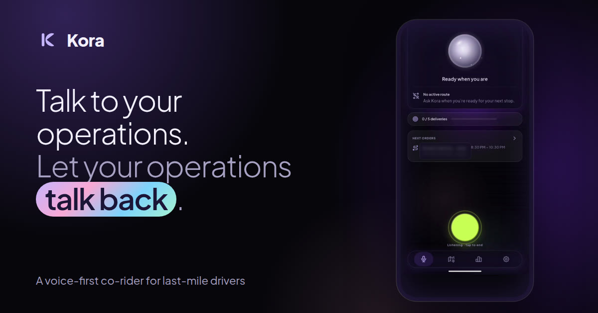
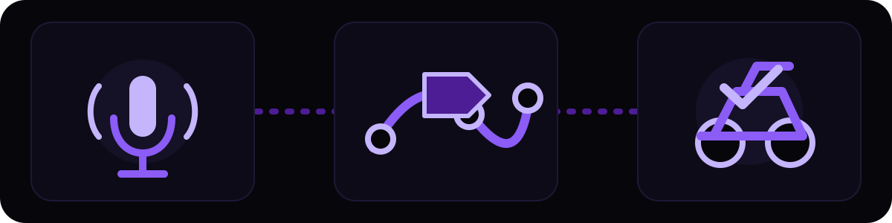
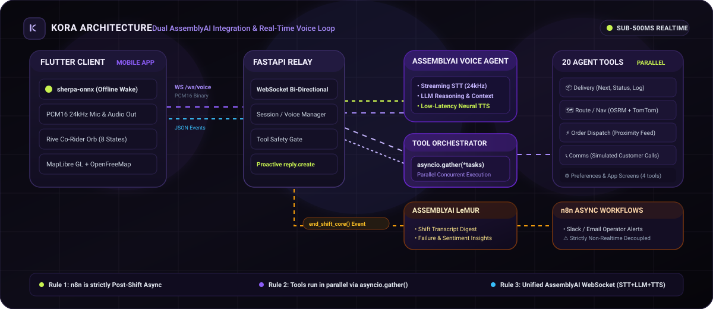
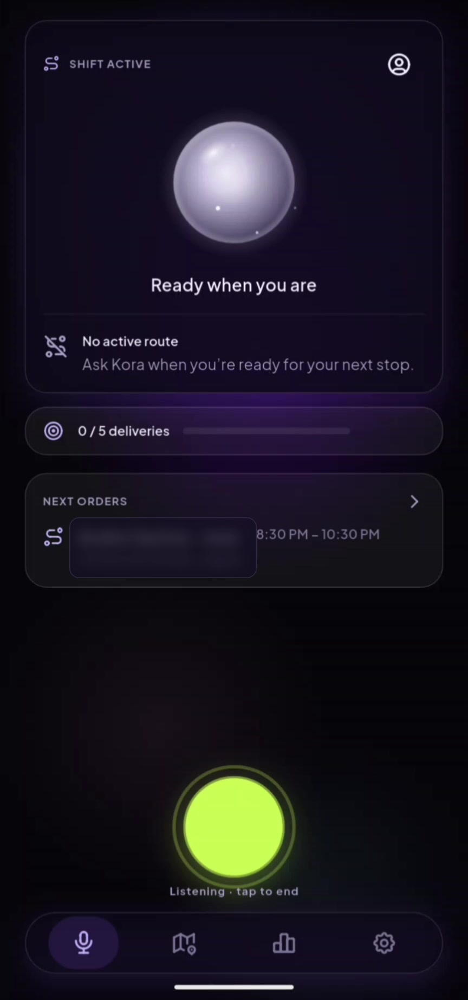
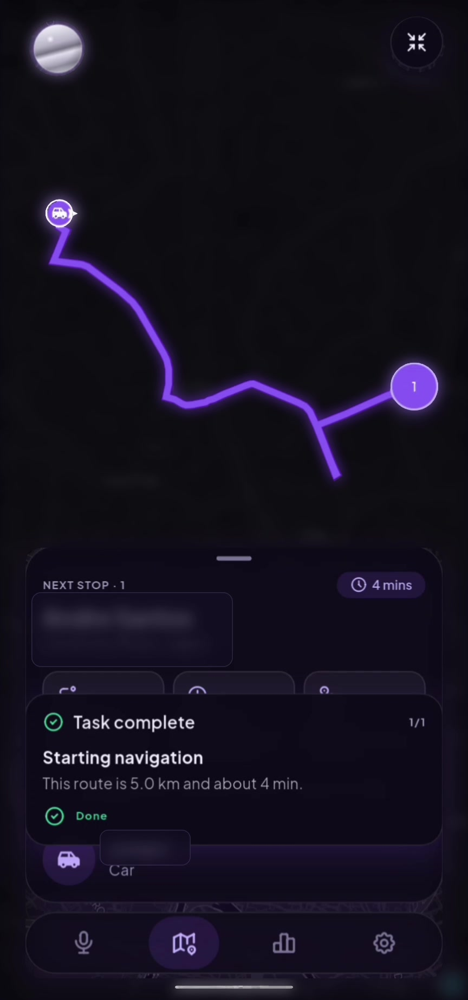
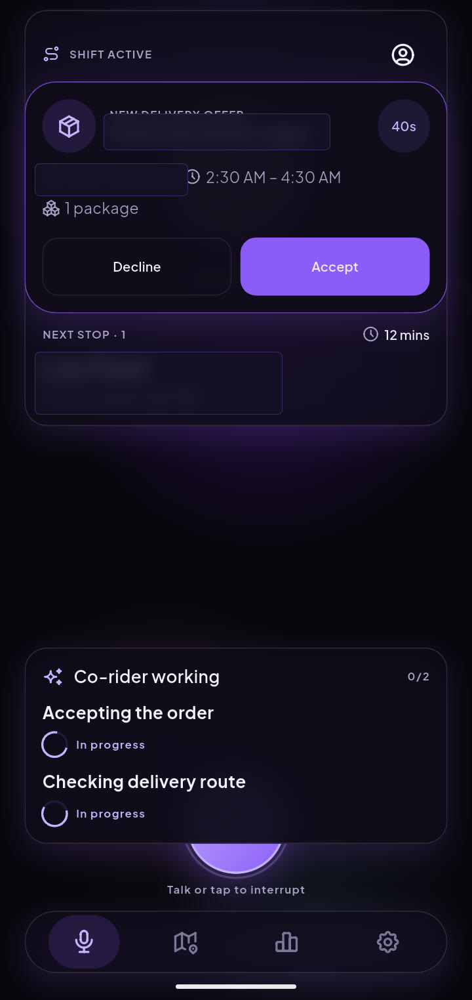
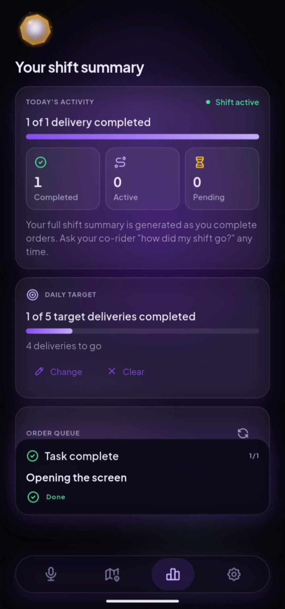
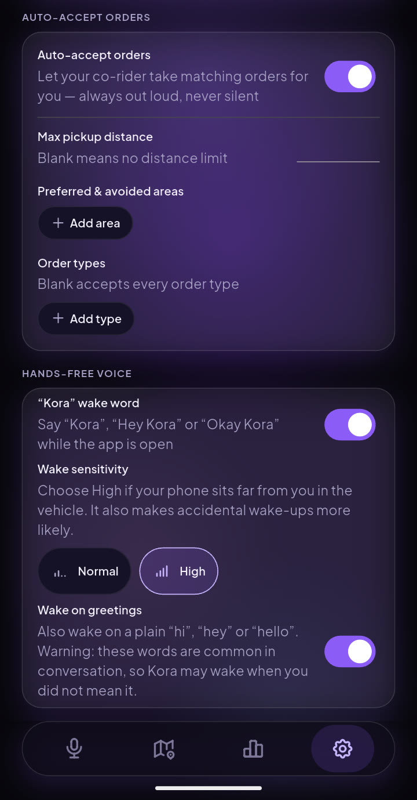
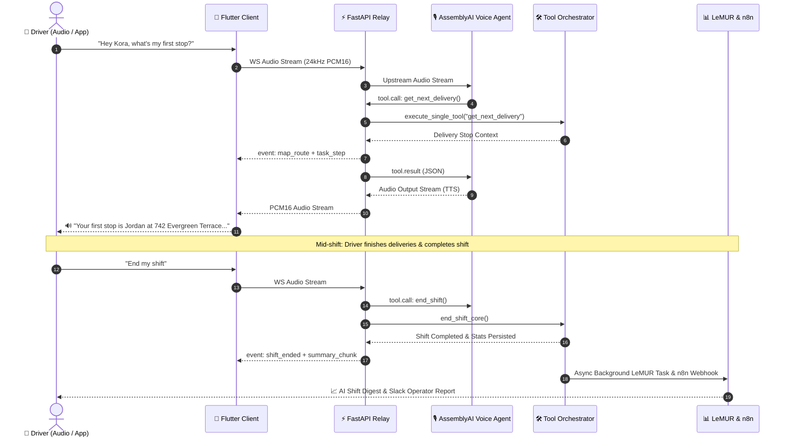

<div align="center">
  <a href="https://github.com/MI-TECHDLIN/kora">
    
  </a>
  <h1 style="margin-top: 14px; margin-bottom: 6px;">Kora</h1>
  <p><strong>Talk to your operations. Let your operations talk back.</strong></p>
  <p><em>An autonomous, voice-first operational co-rider for last-mile delivery couriers and drivers.</em></p>

  <p>
    <a href="https://lablab.ai/ai-hackathons/assemblyai-voice-agent-hackathon"></a>
    <a href="https://flutter.dev/"></a>
    <a href="https://fastapi.tiangolo.com/"></a>
    <a href="https://www.assemblyai.com/"></a>
    <a href="https://supabase.com/"></a>
  </p>
  <p>
    
    
    
    
    
  </p>
</div>

<br>

<div align="center">
  
</div>

<br>

<div align="center">
  <strong><a href="#-executive-summary--the-problem">Problem</a></strong> &nbsp;•&nbsp;
  <strong><a href="#-the-dual-assemblyai-architecture">Dual AssemblyAI</a></strong> &nbsp;•&nbsp;
  <strong><a href="#%EF%B8%8F-system-architecture">System Architecture</a></strong> &nbsp;•&nbsp;
  <strong><a href="#-how-the-backend--agent-engine-works">Agent Engine</a></strong> &nbsp;•&nbsp;
  <strong><a href="#-the-20-autonomous-agent-tools">20 Agent Tools</a></strong> &nbsp;•&nbsp;
  <strong><a href="#-mobile-experience--frontend-architecture">Flutter App</a></strong> &nbsp;•&nbsp;
  <strong><a href="#-a-day-in-the-life-shift-lifecycle">Shift Walkthrough</a></strong> &nbsp;•&nbsp;
  <strong><a href="#%EF%B8%8F-developer-quickstart">Developer Setup</a></strong>
</div>

<br>

---

## 💡 Executive Summary & The Problem

Last-mile couriers and delivery drivers—navigating congested urban corridors on motorbikes, bicycles, cargo bikes, scooters, and vans—face a dangerous cognitive dilemma: **road safety vs. screen friction**.

```
Typical Delivery Shift: 8 Hours | 40+ Stops | 180+ Screen Interactions
[ Check Address ] ➔ [ Search Route ] ➔ [ Dial Gate Code ] ➔ [ Call Customer ] ➔ [ Mark Complete ] ➔ [ Accept Nearby Order ]
```

Every tap, swipe, and glance down at a mounted smartphone compromises driver awareness, introduces route delays, and increases collision risks. 

**Kora solves the interface gap.** 

Kora is a hands-free, autonomous voice co-rider built specifically for last-mile logistics operations. Instead of tapping through multiple disconnected apps, the driver simply speaks naturally to Kora. The agent acts across routing engines, dispatch databases, and telephony networks **in parallel**, returning one calm, unified spoken response while streaming live map updates and progress indicators on screen.

<div align="center">
  
</div>

---

## ⚡ The Dual AssemblyAI Architecture

Kora’s core technical moat is its **Dual AssemblyAI Integration**, deploying two complementary AssemblyAI product layers across the delivery lifecycle:

```
┌────────────────────────────────────────────────────────────────────────────────────────┐
│                                   KORA OPERATIONS                                      │
├──────────────────────────────────────────┬─────────────────────────────────────────────┤
│ 1. REAL-TIME OPERATIONAL LAYER           │ 2. POST-SHIFT INTELLIGENCE LAYER            │
│    (During Active Shift)                 │    (Async Post-Shift Analysis)               │
├──────────────────────────────────────────┼─────────────────────────────────────────────┤
│ • AssemblyAI Voice Agent API             │ • AssemblyAI Speech Understanding & LeMUR   │
│ • Single Unified Bidirectional WebSocket │ • Full Shift Transcript Digest & Synthesis │
│ • 24 kHz Mono PCM16 Streaming            │ • Delivery Failure Pattern Topic Detection  │
│ • Sub-500ms Voice Response SLA           │ • Customer Sentiment Analysis Trends        │
│ • Concurrent Function / Tool Calling     │ • Coaching & Dispatch Efficiency Prompts    │
│ • Neural Text-to-Speech (11 Voices)      │ • Fire-and-Forget Dispatch to n8n Webhooks  │
└──────────────────────────────────────────┴─────────────────────────────────────────────┘
```

1. **Real-Time Voice Agent API**: Consolidates speech-to-text (STT), natural language understanding (LLM), multi-tool execution, and text-to-speech (TTS) into a **single, low-latency WebSocket connection** running at ~$4.50/hr flat. There are zero audio-chopping or sequential bottlenecks.
2. **Post-Shift Intelligence (LeMUR & Speech Understanding)**: Upon shift completion (`end_shift`), full turn histories are aggregated into LeMUR (`anthropic/claude-3-5-sonnet` / `claude-sonnet-5`). It pinpoints access failure clusters, generates operator debriefs, rates customer sentiment, and triggers automated alerts to logistics fleet managers.

---

## 🏛️ System Architecture

Kora’s architecture balances ultra-low latency real-time voice response with resilient, decoupled background intelligence.

<div align="center">
  
</div>

### The Three Inviolable Architectural Rules

> [!IMPORTANT]
> 1. **n8n is strictly isolated to the Post-Shift Async Layer. Never in the real-time path.**  
>    n8n is an HTTP-driven workflow automation engine. Introducing it into the real-time voice path introduces 2,000–3,500ms latency versus 200–500ms via FastAPI asyncio.
> 2. **Tool calls execute in parallel via `asyncio.gather()`.**  
>    Complex courier commands (e.g., *"Mark this stop delivered, navigate to my next customer, and text them I'm 5 minutes away"*) execute concurrently. Sequential awaits are strictly prohibited.
> 3. **The AssemblyAI Voice Agent operates over a single unified WebSocket.**  
>    Audio input, transcription, reasoning, tool execution, and synthesized audio stream across one persistent duplex socket.

---

## 🧠 How the Backend & Agent Engine Works

Kora's backend is powered by **Python 3.11+ FastAPI and asyncio**, engineered to process simultaneous voice frames, map queries, location pings, and telephony webhooks.

### 1. WebSocket Voice Relay (`/ws/voice/{shift_id}`)
Located at `voiceops-backend/app/api/websocket/voice.py`, the relay bridges the Flutter mobile client directly to AssemblyAI’s Voice Agent API:
* **Audio Protocol**: Bidirectional PCM16 little-endian, mono, 24 kHz (2,400 bytes per 50ms frame).
* **JWT Authentication**: Authenticates via `Authorization: Bearer <token>` on the WebSocket upgrade request.
* **UI Event Mirroring**: As tools execute upstream, the relay translates backend state changes into structured client JSON events:
  * `agent_state`: Updates co-rider visual moods (`idle`, `thinking`, `speaking`, `calling`, `mapping`, `task`, `summarizing`, `celebrating`).
  * `task_step`: Real-time execution cards with deterministic rationale (`"This route saves about 7 min versus the alternative."`).
  * `map_route`: Emits route coordinates, turn bounding boxes, and traffic-calibrated ETAs.
  * `order_offer`: Triggers proactive incoming order alerts with countdown timers.
  * `queue_updated`: Synchronizes order stacks across Home, Queue, and Summary tabs.

### 2. Parallel Tool Orchestrator (`app/agents/orchestrator.py`)
When AssemblyAI identifies intent requiring backend action, it emits one or more `tool.call` frames. The `ToolOrchestrator` schedules them immediately:

```python
# Create concurrent coroutines for all requested tools
tasks = [
    cls.execute_single_tool(
        tool_name=tc.get("name"),
        parameters=tc.get("arguments") or {},
        context=context,
        call_id=tc.get("call_id")
    )
    for tc in tool_calls
]

# Dispatch concurrently via asyncio.gather
raw_results = await asyncio.gather(*tasks, return_exceptions=True)
```

The orchestrator tracks per-tool wall-clock execution time, guarantees SLA metrics (<500ms target), and wraps responses into clean JSON envelopes ready for AssemblyAI's voice reply.

### 3. Tool Safety Gate (`app/agents/tool_safety.py`)
All tool requests pass through a security and validation layer before execution:
* Validates shift ownership and active driver session state.
* Clamps and sanitizes user input (e.g. `daily_delivery_target` bounded between 1 and 500).
* Prevents unauthorized order completions or duplicate status transitions.

### 4. Proactive Agent Behaviors
Kora doesn't just respond—it actively monitors operating conditions:
* **Quiet-Moment Order Dispatch**: When a new order matches the driver's proximity, the backend waits for a lull in driver audio and dispatches `reply.create` to announce the order unprompted.
* **Proactive Traffic Rerouting**: Powered by TomTom traffic APIs, Kora monitors live congestion. If delays exceed configured thresholds, it alerts the driver: *"Traffic ahead on 5th Street. I found an alternate route saving 6 minutes. Should I switch?"*
* **Stop Access Briefings**: Pre-alerts drivers to historical failure notes before arrival (e.g., *"Reminder: Jordan's gate code is #4092"*).
* **Automatic Next Stop Announcement**: Immediately upon marking a package delivered, Kora announces the next destination.

---

## 🛠️ The 20 Autonomous Agent Tools

Kora’s running registry (`voiceops-backend/app/agents/tool_registry.py`) exposes **exactly 20 deterministic tools** across 6 operational domains:

| # | Tool Name | Operational Domain | Description & Capabilities | Execution Platform |
|---|---|---|---|---|
| 1 | `get_next_delivery` | **Delivery** | Retrieves the next scheduled delivery stop in the active shift queue. | Onfleet / MockAdapter |
| 2 | `update_delivery_status` | **Delivery** | Marks delivery `delivered`, `failed`, or `rescheduled` with notes. | Supabase + Adapter |
| 3 | `log_exception` | **Delivery** | Records gate access issues, absent recipients, or damaged packages. | Supabase Database |
| 4 | `get_best_route` | **Navigation** | Computes optimal multi-modal turn route (car, motorbike, bike, walk). | OSRM + TomTom |
| 5 | `start_navigation` | **Navigation** | Pushes active route polyline and turn cards directly to Flutter map. | In-App Vector Map |
| 6 | `accept_reroute` | **Navigation** | Swaps active navigation route for traffic-optimized suggested detour. | In-App Navigation |
| 7 | `get_next_order` | **Dispatch** | Fetches the newest order offered to the driver or nearest unassigned. | Order Dispatch Engine |
| 8 | `accept_order` | **Dispatch** | Accepts an offered order, appending it to the driver's current shift. | Order Dispatch Engine |
| 9 | `decline_order` | **Dispatch** | Declines an offer, automatically re-offering to the next closest courier. | Order Dispatch Engine |
| 10 | `call_customer` | **Comms** | Initiates an outbound voice call (supports `DEMO_SIMULATED_CUSTOMER`). | Twilio Voice API |
| 11 | `notify_customer` | **Comms** | Dispatches an automated SMS alert with arrival ETA or delivery note. | Twilio SMS API |
| 12 | `alert_dispatcher` | **Comms** | Escalates critical delivery issues or vehicle emergencies to dispatch. | Supabase + n8n |
| 13 | `get_shift_summary` | **Shift Control** | Reads out live shift statistics: completed stops, remaining stops, ETA. | Supabase Database |
| 14 | `end_shift` | **Shift Control** | Closes active shift, compiles stats, and triggers async LeMUR report. | Supabase + LeMUR + n8n |
| 15 | `end_conversation` | **Shift Control** | Closes active voice mic stream while keeping current shift running. | Internal Voice Relay |
| 16 | `show_screen` | **Shift Control** | Voice-activated tab navigation (`voice`, `map`, `summary`, `settings`). | In-App GoRouter |
| 17 | `get_preferences` | **Preferences** | Reads out driver settings (auto-accept, vehicle type, target). | Supabase Database |
| 18 | `set_preference` | **Preferences** | Modifies driver preference (e.g. daily target, auto-accept radius). | Supabase Database |
| 19 | `clear_preference` | **Preferences** | Resets a specific preference key back to system default. | Supabase Database |
| 20 | `reset_preferences` | **Preferences** | Restores all driver preferences back to baseline defaults. | Supabase Database |

---

## 📱 Mobile Experience & Frontend Architecture

The frontend is a production-grade Flutter application (`frontend/lib/`) designed for high legibility, vibration resistance, and instant glanceability.

### Visual App Tour

<div align="center">
  <table>
    <tr>
      <td align="center" width="20%">
        
        <br><b>Voice Co-Rider</b><br>
        <sub>Rive orb, live transcript &amp; lime mic-hot state</sub>
      </td>
      <td align="center" width="20%">
        
        <br><b>In-App Vector Map</b><br>
        <sub>MapLibre &amp; OpenFreeMap live turn routing</sub>
      </td>
      <td align="center" width="20%">
        
        <br><b>Proximity Offer</b><br>
        <sub>Proactive order alert with 30s countdown</sub>
      </td>
      <td align="center" width="20%">
        
        <br><b>Shift Intelligence</b><br>
        <sub>Post-shift metrics &amp; LeMUR debrief</sub>
      </td>
      <td align="center" width="20%">
        
        <br><b>Persona &amp; Rules</b><br>
        <sub>11 Voice characters &amp; auto-accept filters</sub>
      </td>
    </tr>
  </table>
</div>

### Frontend Highlights

* **Offline On-Device Wake Engine**: Integrated with **sherpa-onnx** to detect *"Kora"*, *"Hey Kora"*, or *"Okay Kora"* completely offline on-device with zero cloud latency. Once awakened, Kora maintains an active **12-second follow-up conversational window** requiring no wake-word repetition.
* **Vector Map Engine**: Uses **MapLibre GL** powered by **OpenFreeMap** vector tiles. Zero Google Maps billing, zero API keys, and routes render directly inside the app—drivers never get kicked out to an external navigation app.
* **Animated Rive Co-Rider Mascot**: Custom state machine (`frontend/lib/mascot/mascot_display.dart`) rendering dynamic emotional and operational states:
  * Two materials: Holographic Bubble Orb for onboarding; Chrome Mercury Orb for daily shifts.
  * 8 reactive states: `idle`, `thinking`, `speaking`, `calling`, `mapping`, `task`, `summarizing`, `celebrating`.
* **11 Spoken Personas**: Choose from 11 distinct AssemblyAI voice characters (`alba`, `eve`, `george`, `jane`, `jean`, `mary`, `michael`, `anna`, `charles`, `paul`, `vera`), switchable in real-time.
* **Safety Design System**:
  * Dark-mode-first canvas (`#07060B`) to eliminate glare during night shifts and conserve battery.
  * Brand violet (`#8B5CF6`) as primary identity accent.
  * **Electric Lime (`#C8F250`) is strictly reserved for the mic-live state**, ensuring the driver knows immediately when the microphone is recording.

---

## 🔄 A Day in the Life: Shift Lifecycle


```mermaid
sequenceDiagram
    autonumber
    actor Driver as 🛵 Driver (Audio / App)
    participant Client as 📱 Flutter Client
    participant Relay as ⚡ FastAPI Relay
    participant AAI as 🎙️ AssemblyAI Voice Agent
    participant Orch as 🛠️ Tool Orchestrator
    participant Post as 📊 LeMUR & n8n

    Driver->>Client: "Hey Kora, what's my first stop?"
    Client->>Relay: WS Audio Stream (24kHz PCM16)
    Relay->>AAI: Upstream Audio Stream
    AAI->>Relay: tool.call: get_next_delivery()
    Relay->>Orch: execute_single_tool("get_next_delivery")
    Orch-->>Relay: Delivery Stop Context
    Relay-->>Client: event: map_route + task_step
    Relay->>AAI: tool.result (JSON)
    AAI-->>Relay: Audio Output Stream (TTS)
    Relay-->>Client: PCM16 Audio Stream
    Client-->>Driver: 🔊 "Your first stop is Jordan at 742 Evergreen Terrace..."

    Note over Driver,Post: Mid-shift: Driver finishes deliveries & completes shift

    Driver->>Client: "End my shift"
    Client->>Relay: WS Audio Stream
    Relay->>AAI: tool.call: end_shift()
    Relay->>Orch: end_shift_core()
    Orch-->>Relay: Shift Completed & Stats Persisted
    Relay-->>Client: event: shift_ended + summary_chunk
    Orch->>Post: Async Background LeMUR Task & n8n Webhook
    Post-->>Driver: 📈 AI Shift Digest & Slack Operator Report
```

---

## 📂 Repository Layout

```text
kora/
├── frontend/                  # Flutter Mobile Application
│   ├── lib/
│   │   ├── app/               # Routing (GoRouter) & theme tokens
│   │   ├── core/              # Theme tokens, design system, network clients
│   │   ├── features/          # Voice, Map, Queue, Summary, Auth, Settings
│   │   ├── mascot/            # Rive co-rider state machine (MascotDisplay)
│   │   └── providers/         # Riverpod global state providers
│   ├── assets/                # Audio previews, vector icons, fonts
│   └── pubspec.yaml           # Flutter dependencies (MapLibre, Riverpod, Rive)
│
├── voiceops-backend/          # FastAPI Backend & Orchestration Service
│   ├── app/
│   │   ├── agents/            # Tool registry (20 tools), safety gate, orchestrator
│   │   ├── api/               # WebSocket voice relay (/ws/voice) & REST routes
│   │   ├── dispatch/          # Proximity order intake & dispatch feed engine
│   │   ├── intelligence/      # LeMUR post-shift pipeline & report synthesis
│   │   ├── integrations/      # OSRM, TomTom, Twilio, LogisticsAdapter
│   │   └── main.py            # FastAPI service entrypoint & lifespans
│   ├── n8n/workflows/         # Exported n8n post-shift intelligence workflows
│   ├── tests/                 # Pytest suite (voice WS, parallel tools, schemas)
│   └── requirements.txt       # Python dependencies (FastAPI, uvicorn, httpx)
│
├── landing/                   # Static Marketing Website & Web Phone Preview
│   ├── assets/                # Brand SVGs, icons, phone screenshots, demo reels
│   ├── js/                    # Dependency-free phone preview & 11-voice player
│   └── index.html             # Marketing site (Cloudflare Pages ready)
│
└── docs/                      # Architectural Contracts & Product Specs
    ├── contracts/interface.md # Frozen WebSocket & REST API specification
    ├── VoiceOps_Agent_Tools_Reference.md # Contract for all 20 agent tools
    └── product/               # PRD v4.0, handoff notes, brand guidelines
```

---

## 🛠️ Developer Quickstart

### Prerequisites
* **Git**
* **Python 3.11+**
* **Flutter SDK** (Dart `^3.11.5`)
* **Supabase Account** (PostgreSQL database & auth)
* **AssemblyAI Account** (API key with Voice Agent and LeMUR access)
* *(Optional)* TomTom API Key (traffic routing), Twilio credentials (calls/SMS)

---

### 1. Backend Setup (`voiceops-backend`)

```bash
# Clone the repository
git clone https://github.com/MI-TECHDLIN/kora.git
cd kora/voiceops-backend

# Set up virtual environment
python3 -m venv .venv
# Linux / macOS:
source .venv/bin/activate
# Windows (PowerShell):
# .\.venv\Scripts\Activate.ps1

# Install dependencies
pip install -r requirements.txt

# Configure environment variables
cp .env.example .env
```

Edit `.env` with your credentials:
```ini
ASSEMBLYAI_API_KEY=your_assemblyai_key
SUPABASE_URL=https://your-project.supabase.co
SUPABASE_SERVICE_ROLE_KEY=your_service_role_key
TOMTOM_API_KEY=your_optional_tomtom_key
DEMO_SIMULATED_CUSTOMER=true # Enables simulated customer calls without Twilio carrier billing
```

Execute the database schema migration by executing [`supabase_schema.sql`](voiceops-backend/supabase_schema.sql) in your Supabase SQL editor.

Start the FastAPI development server:
```bash
uvicorn app.main:app --reload --port 8000
```

> [!TIP]
> Run a single Uvicorn worker process. Live driver WebSocket sessions and proximity order queues are maintained in the event loop memory.

---

### 2. Frontend Setup (`frontend`)

```bash
cd ../frontend

# Install Flutter dependencies
flutter pub get

# Configure client connection
cp config/supabase.prod.json.example config/supabase.prod.json
```

Populate `config/supabase.prod.json` with your Supabase URL, public anonymous key, and local backend address (e.g., `ws://10.0.2.2:8000` for Android emulator or your LAN IP for physical device testing).

Launch the Flutter app:
```bash
flutter run --dart-define-from-file=config/supabase.prod.json
```

---

### 3. Website & Phone Preview (`landing`)

The marketing site in `landing/` is zero-dependency static HTML/CSS/JS:
```bash
cd ../landing
python3 -m http.server 8080
```
Open `http://localhost:8080` in your browser to interact with the phone preview and 11-voice audio selector.

---

## 🧪 Testing & Health Diagnostics

### Diagnostics Endpoints
* `GET /health`: Lightweight liveness check for hosting environments.
* `GET /health/ready`: Deep health probe checking database connectivity and AssemblyAI upstream readiness.
* `GET /health/dispatch`: Proximity order feed inspector detailing active drivers and assignment state without revealing PII coordinates.

### Running Test Suites

```bash
# Run backend pytest suite
cd voiceops-backend
pytest -q

# Run frontend analyzer and unit tests
cd ../frontend
flutter analyze
flutter test
```

### Secret Scanning

Kora enforces automated secret scanning via [Gitleaks](https://github.com/gitleaks/gitleaks):
```bash
# Verify staged commits before pushing
gitleaks git --pre-commit --staged --redact --config .gitleaks.toml
```

---

## 👥 The Team

* **Ez** — Flutter Frontend Lead, Mobile Architecture, Rive Animation & Voice Agent Integration.
* **Maria** — FastAPI Backend Lead, AsyncIO Tool Orchestrator & Real-Time Agentic Workflows.

---

## 🏆 Acknowledgements

Kora was created for the **AssemblyAI Voice Agent Hackathon** hosted on [lablab.ai](https://lablab.ai/) (September 1–30, 2026).

Special thanks to the open-source ecosystems powering Kora:
* [AssemblyAI](https://www.assemblyai.com/) — Real-Time Voice Agent API & LeMUR Speech Understanding.
* [Flutter](https://flutter.dev/) & [Rive](https://rive.app/) — Native mobile UI & interactive vector mascot.
* [FastAPI](https://fastapi.tiangolo.com/) — Async high-concurrency Python framework.
* [MapLibre](https://maplibre.org/) & [OpenFreeMap](https://openfreemap.org/) — Free, open-source vector tile mapping.
* [sherpa-onnx](https://github.com/k2-fsa/sherpa-onnx) — High-efficiency offline on-device wake-word detection.
* [OSRM](https://project-osrm.org/) & [TomTom](https://developer.tomtom.com/) — Open-source and traffic-aware routing engines.
* [Supabase](https://supabase.com/) & [n8n](https://n8n.io/) — Database persistence & async workflow automation.

---

<div align="center">
  <sub>Built with ❤️ for delivery drivers around the world. Keep your eyes on the road and your hands on the bars.</sub>
</div>
