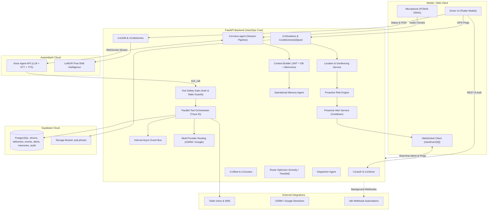

# VoiceOps Backend

FastAPI backend for **VoiceOps** — an autonomous voice-first logistics operations platform and driver companion powered by **AssemblyAI Voice Agent API & LeMUR**, **Supabase PostgreSQL & Storage**, **Twilio**, **OSRM / Google Maps**, and **n8n**.

---

## 📋 Table of Contents
- [Architecture Overview](#-architecture-overview)
- [System Capabilities & Milestones (100% Completed)](#-system-capabilities--milestones-100-completed)
- [Voice Agent Tool Registry & Safety](#-voice-agent-tool-registry--safety)
- [API Endpoints Reference](#-api-endpoints-reference)
- [Real-Time WebSocket Channel](#-real-time-websocket-channel)
- [n8n Workflows Integration](#-n8n-workflows-integration)
- [Setup & Installation](#-setup--installation)
- [Environment Variables](#-environment-variables)
- [Testing & Verification](#-testing--verification)

---

## 🏛 Architecture Overview



---

## 🚀 System Capabilities & Milestones (100% Completed)

### 🔴 Milestone 1 — Core Plumbing & Live Database
- **Live Driver Context**: [`context_builder.py`](app/agents/context_builder.py) dynamically resolves driver identity, vehicle details, active shift, and next delivery from Bearer JWTs, falling back to testing fixtures when unauthenticated.
- **Deterministic Delivery State Machine**: [`delivery_state_machine.py`](app/services/delivery_state_machine.py) enforces legal transitions (`pending` → `en_route` / `arrived` → `delivered` / `failed` → `rescheduled`), rejecting illegal state jumps.
- **Real Database Wiring**: All 10 voice agent tools query and mutate live Supabase tables instead of returning mock data.
- **Schema Hardening**: [`supabase_schema.sql`](supabase_schema.sql) updated with Row Level Security (`INSERT` for drivers, `service_role` full access) and tables: `delivery_events`, `customers`, `proof_of_delivery`, `customer_interactions`, `memories`, `agent_audit_trail`.

### 🔴 Milestone 2 — GPS & Proof of Delivery
- **Location Intelligence & Geofencing**: [`location_service.py`](app/services/location_service.py) computes great-circle Haversine distances and tracks movement states (`DRIVER_MOVING`, `DRIVER_STOPPED`, `DRIVER_IDLE`).
- **Auto-Arrival Detection**: Automatically detects when a driver enters the 100m geofence radius of a delivery stop, transitioning delivery state to `arrived` and generating a `DRIVER_ARRIVED` audit event.
- **Proof of Delivery**: [`storage_service.py`](app/services/storage_service.py) uploads photo and signature attachments to Supabase Storage (`pod-photos` bucket).
- **POD Endpoints**: `POST /v1/deliveries/{id}/pod` records GPS verification, uploads attachments, transitions status to `delivered`, and writes audit records.
- **High-Frequency GPS Pings**: `POST /v1/locations/ping` validates coordinates (-90 to 90 lat, -180 to 180 lng, speed <= 300 km/h) and executes geofence checks.

### 🟡 Milestone 3 — Proactive Intelligence Engine
- **ETA Engine**: [`eta_service.py`](app/services/eta_service.py) calculates arrival times factoring in an urban transit multiplier (1.35x), writes `estimated_arrival` timestamps, and flags time window compliance risks.
- **Risk Detection Engine**: [`risk_engine.py`](app/services/risk_engine.py) evaluates telemetry streams for `EXCESSIVE_IDLE` (>5 min stationary), `TIME_WINDOW_RISK` (projected late arrivals), and `LATE_DELIVERY`.
- **Proactive Alert System**: [`proactive_alert_service.py`](app/services/proactive_alert_service.py) emits voice and push alerts with a 15-minute cooldown per driver/risk-type to prevent repetitive driver interruption.
- **Automated Customer Notification Policy**: [`notification_policy_service.py`](app/services/notification_policy_service.py) triggers automated SMS notifications via Twilio when driver ETA drops below 15 minutes without duplicating recent messages.
- **Autonomous Exception Workflow**: [`exception_workflow.py`](app/services/exception_workflow.py) executes a multi-step escalation protocol (automated call → follow-up SMS → attempt counter increment → dispatcher alert escalation).

### 🟡 Milestone 4 — Routing, WebSocket & Dispatcher
- **Multi-Provider Routing**: [`routing_service.py`](app/services/routing_service.py) and [`osrm.py`](app/integrations/osrm.py) prioritize open-source OSRM, fall back to Google Directions API, and cascade to direct Heuristic calculation if network routes fail.
- **Driver WebSocket Channel**: [`driver_ws.py`](app/api/websocket/driver_ws.py) maintains a persistent `/ws/driver/{driver_id}` connection for live proactive alert dispatching and telemetry streaming.
- **Dispatcher Agent**: [`dispatcher_agent.py`](app/agents/dispatcher_agent.py) analyzes fleet snapshots, identifies bottlenecks, prioritizes critical safety/delay incidents, and suggests shift rebalancing.
- **Fleet Management APIs**: [`fleet.py`](app/api/routes/fleet.py) exposes overview metrics, driver locations, active incidents, and delivery completion KPIs.
- **Tool Safety Gate**: [`tool_safety.py`](app/agents/tool_safety.py) verifies caller authorization (driver ownership) and state transitions before tool execution.

### 🔵 Milestone 5 — Memory, Event Bus & Autonomous Operations
- **Operational Memory Agent**: [`memory_agent.py`](app/agents/memory_agent.py) records long-term observations (e.g. gate codes, customer preferences, parking instructions) and enriches driver session context.
- **Internal Async Event Bus**: [`event_bus.py`](app/services/event_bus.py) decouples core operations via pub/sub (`DeliveryCompleted`, `DriverArrived`, `DispatcherAlertCreated`).
- **Customer Communication Agent**: [`customer_agent.py`](app/agents/customer_agent.py) sandboxes customer interactions to an approved whitelist (`send_eta`, `confirm_status`, `collect_instructions`, `schedule_callback`).
- **Route Optimization Engine**: [`optimization_service.py`](app/services/optimization_service.py) provides a greedy nearest-neighbor stop sequencer and Timefold solver client via `POST /v1/routes/optimize`.
- **Trace IDs & Observability**: [`orchestrator.py`](app/agents/orchestrator.py) assigns a unique UUID `trace_id` to every tool execution and persists structured logs to `agent_audit_trail`.

---

## 🛠 Voice Agent Tool Registry & Safety

All 10 voice agent tools are registered in [`app/agents/tool_registry.py`](app/agents/tool_registry.py) and protected by [`tool_safety.py`](app/agents/tool_safety.py):

| Tool Name | Trigger Phrases | Purpose | Integration |
| :--- | :--- | :--- | :--- |
| `get_next_delivery` | *"next stop", "where to?", "next delivery"* | Retrieves next pending delivery in shift | Supabase `deliveries` |
| `update_delivery_status`| *"mark as delivered", "delivered", "package delivered", "failed"* | Updates status with state machine check | Supabase `deliveries` + State Machine |
| `log_exception` | *"failed delivery", "wrong address", "gate locked", "nobody home"* | Logs exception and triggers autonomous workflow | `exception_workflow` + DB |
| `get_best_route` | *"best route", "any traffic", "check my route", "faster way"* | Calculates optimal driving route | OSRM / Google Maps / Heuristic |
| `start_navigation` | *"navigate", "take me there", "get directions"* | Returns Google Maps deeplink & coords | Flutter `url_launcher` |
| `call_customer` | *"call the customer", "ring customer", "call them"* | Outbound voice call to recipient | Twilio Voice API |
| `notify_customer` | *"message customer", "tell customer I'm close", "send ETA"* | Sends SMS with template or custom text | Twilio Messages API |
| `get_next_order` | *"what's after this?", "next order", "upcoming"* | Previews upcoming stops in manifest | Supabase `deliveries` |
| `get_shift_summary` | *"how am I doing?", "shift summary", "completed so far"* | Returns completed, failed, and remaining counts | Supabase `shifts` stats |
| `alert_dispatcher` | *"alert dispatcher", "contact dispatch", "I need help"* | Escalates priority incident to dispatch console & n8n | Supabase `dispatcher_alerts` + n8n |

---

## 📡 API Endpoints Reference

### Authentication (`/v1/auth`)
- `POST /v1/auth/otp/send` — Send SMS verification OTP.
- `POST /v1/auth/otp/verify` — Verify OTP and return Supabase JWT.

### Driver Profile (`/v1/driver`)
- `GET /v1/driver/profile` — Fetch driver profile.
- `PUT /v1/driver/profile` — Update driver profile.
- `POST /v1/driver/onboard` — Trigger driver onboarding email & notification.

### Shifts (`/v1/shift`)
- `POST /v1/shift/start` — Start a new delivery shift.
- `POST /v1/shift/{shift_id}/end` — End shift, triggering LeMUR transcript analysis and n8n report.
- `POST /v1/shift/{shift_id}/analyze-lemur` — On-demand AssemblyAI LeMUR shift intelligence analysis.
- `GET /v1/shift/{shift_id}/report` — Retrieve shift intelligence report.
- `GET /v1/shift/{shift_id}/stats` — Real-time shift delivery counts.

### Deliveries (`/v1/deliveries`)
- `GET /v1/deliveries?shift_id={id}` — Get deliveries for current shift.
- `PUT /v1/deliveries/{id}/status` — Update delivery status with state machine enforcement.
- `POST /v1/deliveries/{id}/notify` — Send SMS/voice notification to customer.
- `POST /v1/deliveries/{id}/pod` — Upload Proof of Delivery (photo/signature) with GPS validation.
- `GET /v1/deliveries/{id}/pod` — Retrieve existing POD record for delivery.

### GPS & Location (`/v1`)
- `POST /v1/locations/ping` — Ingest high-frequency GPS ping with geofencing and risk detection.
- `GET /v1/drivers/{driver_id}/location` — Current live driver coordinates, speed, and heading.
- `GET /v1/drivers/{driver_id}/history` — Historical GPS breadcrumb trail for a driver.

### Routing & Optimization (`/v1/routes`)
- `POST /v1/routes/calculate` — Driving directions via OSRM / Google Maps.
- `POST /v1/routes/optimize` — Greedy nearest-neighbor route sequencer for pending deliveries.

### Fleet Dispatcher Console (`/v1/fleet`)
- `GET /v1/fleet/overview` — Fleet-wide active drivers, open deliveries, and recommendations.
- `GET /v1/fleet/drivers` — All active drivers with live telemetry and status.
- `GET /v1/fleet/incidents` — Dispatcher alert queue with severity filtering (`urgent`, `critical`).
- `GET /v1/fleet/analytics` — Fleet performance KPIs and delivery completion rates.

### Voice Agent (`/v1`)
- `POST /v1/voice-agent` — Turn-based voice agent audio turn (PCM16 24kHz) with parallel tool dispatch.
- `GET /v1/voice-agent/session-config` — AssemblyAI session configuration schema.

---

## 🔌 Real-Time WebSocket Channel

### Endpoint
```
ws://<host>:8000/ws/driver/{driver_id}
```

### Supported Messages
- **Client Heartbeat**:
  ```json
  {"type": "heartbeat"}
  ```
- **Client Location Ping**:
  ```json
  {
    "type": "location_ping",
    "payload": {
      "latitude": 6.4286,
      "longitude": 3.4108,
      "speed": 28.5,
      "heading": 180.0,
      "shift_id": "uuid"
    }
  }
  ```
- **Server Proactive Alert**:
  ```json
  {
    "type": "PROACTIVE_ALERT",
    "severity": "HIGH",
    "risk_type": "TIME_WINDOW_RISK",
    "message": "Delivery is projected 20 minutes late. Notify customer?",
    "delivery_id": "uuid"
  }
  ```

---

## 📱 n8n Workflows Integration

All n8n automation workflows are triggered asynchronously in server-side background tasks without blocking driver responses:

1. **Dispatcher Alerts** (`n8n/workflows/dispatcher_alerts.json`): Triggered by safety incidents or priority escalations; notifies Slack and email.
2. **Post-Shift Intelligence** (`n8n/workflows/post_shift_intelligence.json`): Triggered upon shift completion; generates executive shift report.
3. **Driver Onboarding** (`n8n/workflows/driver_welcome.json`): Triggered on new driver sign-up; sends welcome email and instructions.

---

## ⚙️ Setup & Installation

### 1. Prerequisites
- Python 3.11+
- Supabase project (PostgreSQL + Storage)
- AssemblyAI API Key
- Twilio Account (for SMS & voice calls)
- Google Maps API Key (optional, OSRM works without key)
- n8n instance (optional, for post-shift automations)

### 2. Install Dependencies
```bash
git clone https://github.com/voiceops-team/voiceops-backend
cd voiceops-backend

python -m venv venv
# Windows:
venv\Scripts\activate
# Linux / macOS:
source venv/bin/activate

pip install -r requirements.txt
```

### 3. Apply Supabase Database Schema
Run the SQL script [`supabase_schema.sql`](supabase_schema.sql) in your **Supabase SQL Editor** to create all tables, indexes, and Row Level Security policies.

---

## 🔐 Environment Variables

Create a `.env` file in the root directory:

```env
# AssemblyAI
ASSEMBLYAI_API_KEY=your_assemblyai_api_key
ASSEMBLYAI_AGENT_ID=your_voice_agent_id

# Supabase
SUPABASE_URL=https://your-project.supabase.co
SUPABASE_SERVICE_KEY=your_service_role_key
SUPABASE_ANON_KEY=your_anon_key

# Twilio (Voice & SMS)
ACCOUNT_SID=your_twilio_account_sid
PRIMARY_AUTH_TOKEN=your_twilio_auth_token
TWILIO_PHONE_NUMBER=your_twilio_number

# Google Maps
GOOGLE_MAPS_API_KEY=your_google_maps_key

# n8n Webhook URLs
N8N_DISPATCHER_WEBHOOK_URL=http://localhost:5678/webhook/dispatcher-alert
N8N_POST_SHIFT_WEBHOOK_URL=http://localhost:5678/webhook/post-shift-intelligence
N8N_DRIVER_ONBOARDING_WEBHOOK_URL=http://localhost:5678/webhook/driver-onboarding

# Operational Emails
DISPATCHER_ESCALATION_EMAIL=dispatch@yourdomain.com
OPERATOR_REPORT_EMAIL=ops@yourdomain.com

# App Configuration
JWT_SECRET=your_jwt_secret_key
ENVIRONMENT=development
ALLOWED_ORIGINS=*
```

---

## 🧪 Testing & Verification

> **Deployment:** run exactly one uvicorn worker (see `Procfile`). Order-offer state and voice sessions are per process; see `../docs/backend-handoff/order-accept-multi-worker.md`.

### Start the Local Server
```bash
uvicorn app.main:app --reload --port 8000
```

### Run Automated Unit Test Suite
Execute all 25 unit tests covering the state machine, location intelligence, ETA service, risk engine, proactive alerts, routing, tool safety, dispatcher agent, memory agent, event bus, customer agent, and tool execution:

```bash
python -m pytest -v
```

Plain `pytest` discovers every `tests/test_*.py` and runs the offline tests. Tests that need a running backend or a real service carry the `live` marker, tests that need a sound device carry `audio`, and tests that need real keys carry `credentials`. They are skipped with the reason printed. Run the live ones with `pytest --run-live` (or `VOICEOPS_RUN_LIVE=1`). Manual scripts live in `tests/live_*.py` and are not collected. `pytest-asyncio` must be the version pinned in `requirements.txt`: older releases crash on collection.

Expected output:
```text
tests/test_milestones_unit.py::test_delivery_state_machine_valid_transitions PASSED
tests/test_milestones_unit.py::test_delivery_state_machine_terminal_state PASSED
tests/test_milestones_unit.py::test_haversine_distance_calculation PASSED
tests/test_milestones_unit.py::test_compute_eta PASSED
tests/test_milestones_unit.py::test_eta_service_minutes PASSED
tests/test_milestones_unit.py::test_alert_service_cooldown PASSED
tests/test_milestones_unit.py::test_exception_workflow PASSED
tests/test_milestones_unit.py::test_routing_service_calculation PASSED
tests/test_milestones_unit.py::test_tool_safety_gate PASSED
tests/test_milestones_unit.py::test_dispatcher_agent_risk_evaluation PASSED
tests/test_milestones_unit.py::test_memory_agent_worthiness PASSED
tests/test_milestones_unit.py::test_event_bus_pub_sub PASSED
tests/test_milestones_unit.py::test_customer_agent_sandboxing PASSED
tests/test_milestones_unit.py::test_optimization_service_greedy PASSED
tests/test_milestones_unit.py::test_tool_orchestrator_trace_id PASSED
tests/test_tools_unit.py::test_tool_definitions PASSED
tests/test_tools_unit.py::test_get_next_delivery PASSED
tests/test_tools_unit.py::test_update_delivery_status PASSED
tests/test_tools_unit.py::test_call_customer PASSED
tests/test_tools_unit.py::test_notify_customer PASSED
tests/test_tools_unit.py::test_alert_dispatcher PASSED
tests/test_tools_unit.py::test_unknown_tool PASSED
tests/test_twilio.py::test_twilio_client_initialized PASSED
tests/test_twilio.py::test_make_call_structure PASSED
tests/test_twilio.py::test_send_sms_structure PASSED

======================= 25 passed in 6.77s =======================
```

---

## 📄 License
MIT License © 2026 VoiceOps Team.
